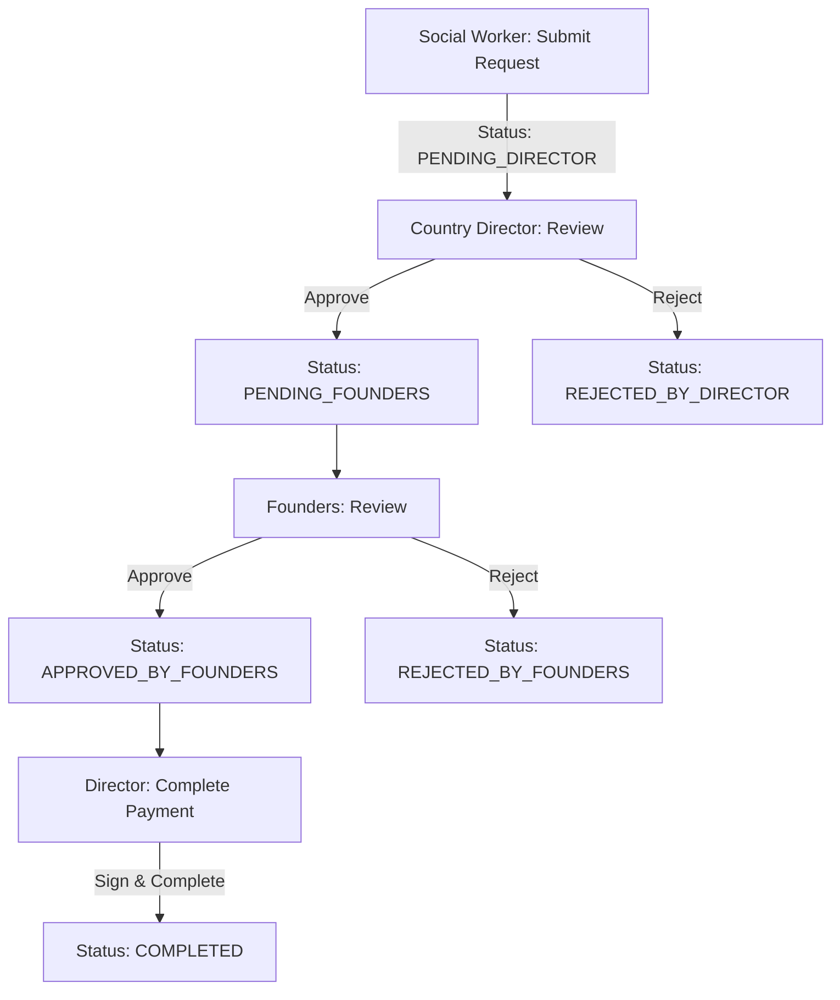

# Them to Jesus - NGO Internal Management System

A complete, production-ready management system built with Next.js 14, featuring role-based access control, real-time chat, emergency request workflows, and comprehensive budget tracking.

## 🎯 Overview

This system manages:
- **Budget & Accounting**: Income/expense tracking with category analysis
- **Emergency Requests**: Multi-level approval workflow
- **Real-Time Chat**: Private and group messaging
- **News & Updates**: Social worker can post progress reports with images
- **Role-Based Access**: Founders, Country Director, Social Worker

## 🚀 Quick Start

### 1. Clone and Install
```bash
cd them-to-jesus-ngo
npm install
```

### 2. Setup Environment
```bash
cp .env.example .env
# Edit .env with your credentials
```

### 3. Setup Database
```bash
npx prisma generate
npx prisma migrate dev
npx prisma db seed
```

### 4. Run Development Server
```bash
npm run dev
```

Visit http://localhost:3000

## 👥 User Roles & Permissions

### 🏢 Founders (Germany)
**Can:**
- ✅ Approve/reject emergency requests (final approval)
- ✅ View all expenses and incomes
- ✅ View total available funds
- ✅ Access all financial reports
- ✅ Private chat with director
- ✅ Group chat with all team
- ✅ View social worker updates

**Cannot:**
- ❌ Add income or expenses
- ❌ Complete emergency payments

**Dashboard Features:**
- Budget overview with charts
- Pending emergency requests requiring approval
- Recent financial transactions
- Monthly income/expense trends
- Real-time notifications

### 🇷🇼 Country Director (Rwanda - Olivier)
**Can:**
- ✅ Add income entries (when founders send budget)
- ✅ Add expense entries
- ✅ View total available funds
- ✅ First-level approval of emergency requests
- ✅ Complete payments after founder approval (with digital signature)
- ✅ Access all financial reports
- ✅ Chat with founders and social worker
- ✅ View social worker updates

**Cannot:**
- ❌ Final approval of emergency requests (needs founder sign-off)

**Dashboard Features:**
- Budget management interface
- Emergency request approval queue
- Income/expense entry forms
- Payment completion workflow
- Category-wise expense breakdown

### 👥 Social Worker (Muhanga - Nicole)
**Can:**
- ✅ Submit emergency fund requests
- ✅ Post updates with images
- ✅ Chat with director and founders
- ✅ View status of own requests
- ✅ Upload supporting documents

**Cannot:**
- ❌ View total budget or available funds
- ❌ See other people's emergency requests
- ❌ View income or expense data
- ❌ Access financial reports

**Dashboard Features:**
- Emergency request submission form
- Request status tracker
- News posting interface with image upload
- Chat messaging

## 💰 Budget System

### How It Works

```
TOTAL AVAILABLE = 
  SUM(all income) 
  - SUM(all expenses) 
  - SUM(completed emergency requests)
```

### Income Sources
- Monthly Budget (from founders)
- Donor Gifts
- Other income

### Expense Categories
- Rent
- Food
- School fees
- Health/Medical
- Transport
- Utilities
- Emergency
- Other

### Visibility
- **Visible to**: Founders, Country Director
- **Hidden from**: Social Worker

## 🚨 Emergency Request Workflow



### Request Fields
- **Amount**: Required amount in RWF
- **Reason**: Detailed explanation (min 10 characters)
- **Urgency**: LOW, MEDIUM, HIGH, CRITICAL
- **Location**: Where funds are needed
- **Supporting Document**: Optional image/PDF upload
- **Status tracking**: Automatic timestamps for each step

### Workflow Rules
1. Social worker **cannot** see total budget
2. Director **must** approve before founders see request
3. Founders **give final approval**
4. Director **completes payment** and signs off
5. All actions are **audit logged**

## 💬 Real-Time Chat System

### Channels
- **Founders ↔ Director**: Private channel for leadership
- **All Team**: Group channel (Founders + Director + Social Worker)
- **Request-specific**: Message threads on emergency requests

### Features
- Real-time delivery via Ably
- Message history stored in PostgreSQL
- Read receipts
- Online status indicators
- Mobile-responsive design

## 📸 News & Updates System

Social workers can post:
- Text updates about program progress
- Multiple images per post
- Reports on girls in the program
- Success stories and milestones

**Visibility**: Only Founders and Director can see posts

**Storage**: Images stored in Supabase, metadata in PostgreSQL

## 🔐 Security Features

### Authentication
- NextAuth.js with JWT tokens
- Bcrypt password hashing (10 rounds)
- Session expiry (30 days)
- Secure cookie handling

### Authorization
- Middleware-based route protection
- Server-side role validation
- API endpoint permission checks
- Database-level access control

### Audit Logging
Every significant action is logged:
- Who performed the action
- What was changed
- When it happened
- IP address (if available)
- Previous and new values

**Audited Actions:**
- Emergency request approvals/rejections
- Income additions
- Expense additions
- Budget access
- Payment completions

### File Upload Security
- File type validation
- Size limits (5MB max)
- Secure URLs from Supabase
- Automatic virus scanning (via Supabase)
- Access control per bucket

## 📊 Dashboard Features

### Founder Dashboard
```
┌─────────────────────────────────────┐
│ Budget Overview                     │
│ ├─ Total Available: RWF X          │
│ ├─ This Month: Income vs Expenses  │
│ └─ Chart: 6-month trend            │
├─────────────────────────────────────┤
│ Pending Approvals (3)              │
│ ├─ Emergency Request #1 [HIGH]     │
│ ├─ Emergency Request #2 [MEDIUM]   │
│ └─ Emergency Request #3 [CRITICAL] │
├─────────────────────────────────────┤
│ Recent Activity                     │
│ └─ Latest income/expenses          │
└─────────────────────────────────────┘
```

### Director Dashboard
```
┌─────────────────────────────────────┐
│ Quick Actions                       │
│ ├─ Add Income                       │
│ ├─ Add Expense                      │
│ └─ View Budget                      │
├─────────────────────────────────────┤
│ Emergency Requests                  │
│ ├─ Pending Review (2)               │
│ ├─ Awaiting Founder Approval (1)   │
│ └─ Ready to Complete (1)            │
├─────────────────────────────────────┤
│ This Month                          │
│ ├─ Income: RWF X                    │
│ ├─ Expenses: RWF Y                  │
│ └─ Balance: RWF Z                   │
└─────────────────────────────────────┘
```

### Social Worker Dashboard
```
┌─────────────────────────────────────┐
│ Post Update                         │
│ └─ Share news and photos           │
├─────────────────────────────────────┤
│ My Emergency Requests               │
│ ├─ Request #1 [Pending Director]   │
│ ├─ Request #2 [Approved]            │
│ └─ Request #3 [Completed]           │
├─────────────────────────────────────┤
│ Recent Posts                        │
│ └─ Your latest updates             │
└─────────────────────────────────────┘
```

## 📱 Mobile Responsive

Fully optimized for mobile devices:
- Touch-friendly buttons (min 44x44px)
- Responsive tables (horizontal scroll)
- Mobile navigation menu
- Optimized images
- Fast load times

## 🎨 Design System

### Colors
- **Primary**: Blue (#3B82F6) - Trust, stability
- **Success**: Green (#10B981) - Approvals, positive actions
- **Warning**: Yellow (#F59E0B) - Pending, caution
- **Danger**: Red (#EF4444) - Rejections, urgent
- **Neutral**: Gray shades - UI elements

### Typography
- **Font**: Inter (sans-serif)
- **Headings**: Bold, 24-32px
- **Body**: Regular, 14-16px
- **Small**: 12-14px (metadata, labels)

### Components
All components from Shadcn/ui:
- Buttons with variants
- Cards for content sections
- Dialogs for forms
- Tables with sorting/filtering
- Toasts for notifications
- Badges for status

## 📈 Reporting Features

### Budget Reports
- Monthly income vs expenses
- Category-wise expense breakdown
- Yearly trends
- Export to PDF/Excel

### Emergency Reports
- Request history
- Approval rates
- Average response time
- Urgency distribution

### Audit Reports
- All logged actions
- Filter by date/user/action
- Export capabilities

## 🔧 API Endpoints

### Authentication
- `POST /api/auth/signin` - Login
- `POST /api/auth/signout` - Logout
- `GET /api/auth/session` - Get current session

### Budget
- `GET /api/budget` - Get budget summary
- `GET /api/income` - List income
- `POST /api/income` - Add income (Director only)
- `GET /api/expense` - List expenses
- `POST /api/expense` - Add expense (Director only)

### Emergency Requests
- `GET /api/emergency` - List requests (filtered by role)
- `POST /api/emergency` - Create request (Social Worker)
- `PATCH /api/emergency/[id]` - Approve/reject/complete
- `GET /api/emergency/[id]` - Get request details

### Chat
- `GET /api/chat/channels` - List user's channels
- `GET /api/chat/[channelId]` - Get messages
- `POST /api/chat/[channelId]` - Send message

### Posts
- `GET /api/posts` - List posts
- `POST /api/posts` - Create post (Social Worker)
- `DELETE /api/posts/[id]` - Delete post

### Files
- `POST /api/upload` - Upload file to Supabase
- `DELETE /api/upload/[id]` - Delete file

## 🧪 Testing

### Setup Test Data
```bash
# Seed database with test data
npx prisma db seed
```

### Test Accounts
```
Founder 1:
- Email: founder1@themtojesus.org
- Password: password123

Founder 2:
- Email: founder2@themtojesus.org
- Password: password123

Country Director:
- Email: olivier@themtojesus.org
- Password: password123

Social Worker:
- Email: nicole@themtojesus.org
- Password: password123
```

### Test Scenarios

**1. Emergency Request Flow**
```bash
1. Login as Social Worker
2. Submit emergency request
3. Logout, login as Director
4. Approve request
5. Logout, login as Founder
6. Approve request
7. Logout, login as Director
8. Complete payment with signature
```

**2. Budget Management**
```bash
1. Login as Director
2. Add income entry
3. Add expense entry
4. View budget summary
5. Verify calculations
```

**3. Chat System**
```bash
1. Login as Founder
2. Send message to director
3. Open separate browser, login as Director
4. Verify real-time message delivery
```

## 🚀 Deployment

### Recommended: Vercel

1. Push code to GitHub
2. Import project in Vercel
3. Add environment variables
4. Deploy

### Database: Railway/Supabase
- Automatic backups
- Built-in PostgreSQL
- Easy connection strings

### File Storage: Supabase
- Already configured
- CDN delivery
- Automatic optimization

## 📦 Project Structure

```
them-to-jesus-ngo/
├── app/
│   ├── api/                    # API routes
│   │   ├── auth/
│   │   ├── budget/
│   │   ├── emergency/
│   │   ├── expense/
│   │   ├── income/
│   │   ├── chat/
│   │   └── posts/
│   ├── dashboard/              # Main dashboard
│   ├── login/                  # Login page
│   ├── globals.css
│   └── layout.tsx
├── components/
│   ├── ui/                     # Shadcn components
│   ├── dashboard/              # Dashboard components
│   ├── forms/                  # Form components
│   └── providers.tsx
├── lib/
│   ├── prisma.ts              # Database client
│   ├── auth.ts                # Auth config
│   ├── supabase.ts            # File storage
│   ├── ably.ts                # Real-time
│   └── utils.ts               # Utilities
├── prisma/
│   ├── schema.prisma
│   └── seed.ts
├── middleware.ts
├── .env.example
├── package.json
├── SETUP.md                   # Detailed setup guide
└── README.md                  # This file
```

## 🛠️ Tech Stack Details

- **Framework**: Next.js 14 (App Router)
- **Language**: TypeScript
- **Database**: PostgreSQL
- **ORM**: Prisma
- **Auth**: NextAuth.js
- **File Storage**: Supabase Storage
- **Real-time**: Ably
- **Styling**: Tailwind CSS
- **Components**: Shadcn/ui
- **Validation**: Zod
- **Icons**: Lucide React

## 📝 Development Workflow

### Adding New Features

1. **Database Changes**
```bash
# Modify prisma/schema.prisma
npx prisma migrate dev --name feature_name
```

2. **API Routes**
```bash
# Create in app/api/feature/route.ts
# Add validation with Zod
# Include auth checks
# Add audit logging
```

3. **UI Components**
```bash
# Create in components/feature/
# Use Shadcn components
# Add TypeScript types
# Implement error handling
```

4. **Testing**
```bash
# Test manually
# Verify permissions
# Check mobile responsiveness
# Test edge cases
```

## 🔍 Monitoring & Maintenance

### Daily
- Check for failed requests (Ably dashboard)
- Review audit logs for suspicious activity
- Monitor error logs

### Weekly
- Review emergency request trends
- Check budget vs actual spending
- Database backup verification

### Monthly
- Generate financial reports
- Review user permissions
- Update dependencies
- Performance optimization

## 🆘 Support & Troubleshooting

### Common Issues

**1. Database Connection Failed**
```bash
# Check PostgreSQL is running
# Verify DATABASE_URL in .env
# Test connection: npx prisma db pull
```

**2. File Upload Fails**
```bash
# Check Supabase bucket permissions
# Verify file size < 5MB
# Check CORS settings in Supabase
```

**3. Chat Not Real-Time**
```bash
# Verify Ably API key
# Check browser console for errors
# Ensure WebSocket not blocked by firewall
```

**4. Login Issues**
```bash
# Verify NEXTAUTH_SECRET is set
# Check NEXTAUTH_URL matches current URL
# Clear browser cookies
```

## 📄 License

Private - Them to Jesus NGO  
All rights reserved.

## 👨‍💻 Developer

Built with ❤️ for Them to Jesus NGO  
Developer: Olivier (olivier@themtojesus.org)

## 🎯 Next Steps

After basic setup:

1. ✅ Test all user flows
2. ✅ Customize email templates
3. ✅ Set up production database
4. ✅ Configure Supabase buckets
5. ✅ Deploy to Vercel
6. ✅ Train users
7. ✅ Monitor for first week
8. ✅ Gather feedback
9. ✅ Iterate and improve

---

**Need Help?** Check SETUP.md for detailed installation instructions.
